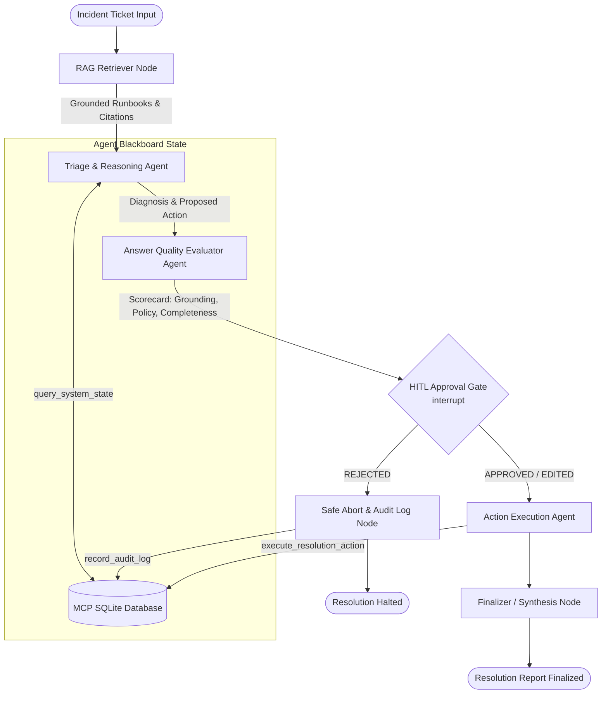

# Day 8 Capstone Build — Multi-Agent RAG Assistant with MCP Tools & Checkpointed HITL Gate

An integrated, enterprise-grade Operations Support & Incident Remediation Assistant built in **LangGraph** (`@langchain/langgraph`). It reasons across multiple agents, grounds decisions in a vector-backed **Retrieval-Augmented Generation (RAG)** knowledge base, interacts with external systems via a **Model Context Protocol (MCP)** server, evaluates answer quality automatically, and enforces a checkpointed **Human-in-the-Loop (HITL)** approval gate prior to committing high-impact actions.

---

## 🏛️ System Architecture



---

## 🎯 Capstone Requirements Met

| Requirement | Implementation Detail | Source File |
| :--- | :--- | :--- |
| **RAG-Backed** | Vector store with cosine similarity, metadata filtering, chunking, and dual Gemini/local embeddings retrieving operational runbooks and SLA policies with `[REF-X]` citations. | [`src/rag/retriever.mjs`](./src/rag/retriever.mjs), [`src/rag/vector-store.mjs`](./src/rag/vector-store.mjs) |
| **Multi-Agent Reasoning** | **3 Specialized Agents**: (1) Triage Agent (diagnostician), (2) Quality Evaluator Agent (audit & policy), (3) Execution Agent (MCP tool invoker). | [`src/agent/nodes.mjs`](./src/agent/nodes.mjs), [`src/agent/graph.mjs`](./src/agent/graph.mjs) |
| **Model Context Protocol (MCP)** | MCP Server exposing tools (`query_system_state`, `execute_resolution_action`, `record_audit_log`) and resources (`incident://active`, `audit://log`) backed by SQLite. | [`src/mcp/server.mjs`](./src/mcp/server.mjs), [`src/mcp/client.mjs`](./src/mcp/client.mjs) |
| **LangGraph Framework** | `StateGraph` with explicit `Annotation.Root` blackboard state schema, conditional routing, and `MemorySaver` checkpointer. | [`src/agent/state.mjs`](./src/agent/state.mjs), [`src/agent/graph.mjs`](./src/agent/graph.mjs) |
| **Human-in-the-Loop (HITL) Gate** | Native checkpoint interrupt via LangGraph `interrupt()`, pausing before executing financial/database mutations. Resumes with `Command({ resume: decision })`. | [`src/agent/nodes.mjs`](./src/agent/nodes.mjs), [`demo.mjs`](./demo.mjs) |
| **Answer Quality Evaluation** | Automated multi-factor rubric evaluating Grounding (40%), Policy Compliance (35%), and Completeness (25%), checking financial ceilings and citation validity. | [`src/eval/quality-evaluator.mjs`](./src/eval/quality-evaluator.mjs) |
| **Demo Script & Verification** | Self-contained, automated & interactive demo script and full test suite covering all components. | [`demo.mjs`](./demo.mjs), [`verify-day8.mjs`](./verify-day8.mjs) |

---

## 📚 Learning Block A — AI Coding Tools Synthesis

### 1. GitHub Copilot
- **Where it helps**: Inline code completion shines for boilerplate, typing out repetitive schema definitions, standard SQL queries, and completing known idioms.
- **Where it misleads**: Lacks repository-wide semantic index beyond open tabs; can hallucinate outdated API methods (e.g., deprecated LangChain syntax) or invent phantom parameter options.

### 2. Cursor
- **Where it helps**: Codebase-aware indexing (`@codebase`), multi-file edits, and instant diff previews allow rapid refactoring of imports and interfaces across several files simultaneously.
- **Rules files**: Leveraging `.cursorrules` or `.agents/rules/` ensures the model adheres to strict architectural constraints (e.g., ESM `"type": "module"`, explicit type annotations, avoiding `any`).

### 3. Claude Code & Agentic Workflows
- **Terminal Agent Workflows**: Excels at delegating multi-step tasks (e.g., run test -> inspect error log -> edit file -> rerun test until green).
- **Reviewing Diffs**: Agentic terminal workflows require careful inspection of diffs before committing to ensure tests aren't weakened or critical edge-case validations removed.

### 4. Effective Prompting & Validation Strategy
- **Prompt Formulation**: Specify clear roles, strict JSON schemas (`responseMimeType: "application/json"`), explicit boundary conditions, and require citations (`[REF-X]`).
- **Validation**: Never trust raw model output for destructive actions. All state mutations must pass through an automated Evaluator and a Human-in-the-Loop gate.

---

## 🚀 Getting Started

### 1. Installation
```bash
cd Day8
npm install
```

### 2. Environment Configuration
Create your `.env` file (copied automatically from template):
```bash
cp .env.example .env
```
Ensure your Gemini API key is configured:
```env
GEMINI_API_KEY=your_gemini_api_key_here
GEMINI_MODEL=gemini-3.1-flash-lite
```

### 3. Run Automated Verification Tests
Run the 26-test comprehensive verification suite:
```bash
npm test
```

### 4. Run the Capstone Demo
Demonstrates the full end-to-end pipeline (RAG retrieval -> Multi-agent reasoning -> Quality evaluation -> HITL interrupt -> MCP Tool call -> Database verification):

```bash
# Auto-approve flow (demonstrates complete execution):
node demo.mjs --auto-approve

# Reject flow (demonstrates human rejection and safe abort):
node demo.mjs --reject

# Interactive CLI flow (prompts human operator for decision):
node demo.mjs
```

### 5. Interactive Assistant CLI
Run against any incident ticket:
```bash
# Triage default ticket INC-8091
npm start

# Triage specific ticket
node run-assistant.mjs INC-8092

# Headless automated execution
node run-assistant.mjs --auto-approve
```

### 6. Standalone Quality Evaluation Demo
Run the standalone answer quality evaluation benchmark:
```bash
npm run eval
```

---

## 🔬 Deep Dive: Answer Quality Evaluation Engine

The evaluation module ([`src/eval/quality-evaluator.mjs`](./src/eval/quality-evaluator.mjs)) scores agent proposals against three objective metrics:

1. **Factual Grounding (40 points)**:
   - Validates that citations (`[REF-1]`, `[REF-2]`) are present both in metadata and within the diagnosis narrative.
   - Computes semantic term overlap with retrieved runbooks to prevent hallucination.
2. **Policy Compliance (35 points)**:
   - Asserts that proposed action is an allowed SOP remediation type (`APPLY_SLA_CREDIT`, `SCALE_READ_REPLICA`, etc.).
   - Validates financial limits (standard ceiling $\le \$500.00$ per `KB-POLICY-002`; flags any unapproved amounts).
3. **Completeness & Action Specificity (25 points)**:
   - Validates that diagnosis provides sufficient root cause explanation ($>80$ characters).
   - Asserts that the MCP action payload includes valid target ticket ID, parameters, and justification notes.

---

## 🛡️ Model Context Protocol (MCP) Integration

The assistant connects to a specialized Operations MCP Server ([`src/mcp/server.mjs`](./src/mcp/server.mjs)):

- **Tools**:
  - `query_system_state`: Read-only queries to inspect customers, tickets, and telemetry.
  - `execute_resolution_action`: High-impact state mutation that executes approved remediation, updates incident status, and applies SLA credits.
  - `record_audit_log`: Appends an immutable audit entry recording operator authorization.
- **Resources**:
  - `incident://active`: Exposes all unresolved P1/P2 incidents.
  - `audit://log`: Exposes the compliance audit trail.

---

## 📁 Repository Structure

```
Day8/
├── data/
│   ├── knowledge-base.json       # Operational runbooks & SLA policies
│   ├── operations.db             # SQLite database (tickets, customers, audit logs)
│   └── test_verify.db            # Test database for verification runs
├── src/
│   ├── rag/
│   │   ├── similarity.mjs        # Vector similarity (cosine, dot product)
│   │   ├── vector-store.mjs      # Embedding & vector retrieval engine
│   │   └── retriever.mjs         # RAG retriever & citation formatter
│   ├── mcp/
│   │   ├── db.mjs                # SQLite persistence engine via sql.js
│   │   ├── server.mjs            # Custom MCP Server (tools & resources)
│   │   └── client.mjs            # MCP Client bridge (stdio / in-memory)
│   ├── eval/
│   │   └── quality-evaluator.mjs # Answer quality & policy evaluation engine
│   └── agent/
│       ├── state.mjs             # LangGraph Annotation.Root blackboard schema
│       ├── nodes.mjs             # Triage, Evaluator, HITL Gate, Executor nodes
│       └── graph.mjs             # StateGraph workflow assembly & routing
├── demo.mjs                      # Capstone end-to-end demonstration script
├── run-assistant.mjs             # Interactive CLI assistant runner
├── verify-day8.mjs               # 26-test verification suite
├── package.json                  # Project dependencies and npm scripts
└── README.md                     # Architecture, documentation, and reflections
```
